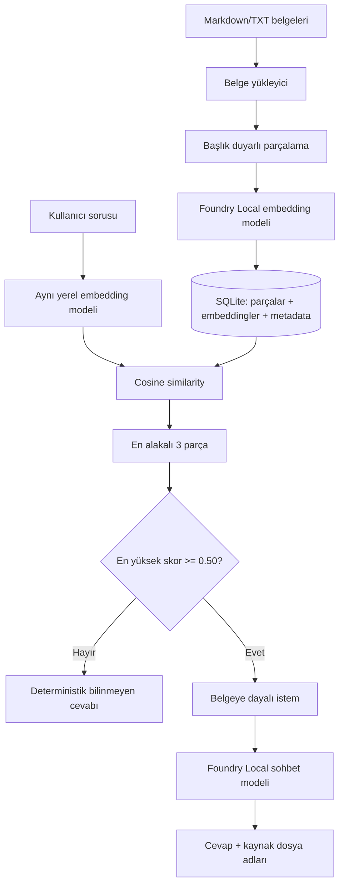

# Microsoft Foundry Local ile Yerel RAG Çalışma Asistanı

Tamamen cihaz üzerinde çalışan bu uygulama, yerel yazılım mühendisliği notlarında semantic arama yapar ve yalnızca bulunan belge parçalarına dayanarak cevap üretir. Normal soru-cevap çalışması OpenAI cloud, Azure OpenAI veya başka bir uzak LLM servisi gerektirmez.

## Problem ve amaç

Genel amaçlı dil modelleri ders notlarının güncel veya özel içeriğini bilmeyebilir ve bilgileri uydurabilir. Bu proje, kullanıcı sorusuna önce yerel belgelerden kanıt bulur; ardından bu kanıtı bilgisayarda çalışan Foundry Local modeline vererek kısa, grounded bir cevap ve source dosya adları döndürür. Belgelerde yeterli kanıt yoksa deterministik olarak bilgi bulunmadığını söyler.

## RAG nedir?

Retrieval-Augmented Generation (RAG), cevap üretmeden önce ilgili bilgiyi bir knowledge base'den getiren akıştır. Bu projede retrieval gerçek embedding vektörleri ve cosine similarity ile yapılır; keyword arama veya sabit cevap kullanılmaz.



## Foundry Local'ın rolü

- Chat: `qwen3.5-2b-text`
- Embedding: `qwen3-embedding-0.6b`
- SDK: `foundry-local-sdk==1.2.4`
- Test edilen platform: Apple M1 arm64, 8 GB RAM, macOS, Python 3.12

Alias kullanımı Foundry Local'ın cihaz için uygun varyantı seçmesine izin verir. Bu cihazda katalog WebGPU varyantlarını seçti. Modeller ilk kullanımda indirilir, sonra yerel cache'den yüklenir ve uygulama kapanırken unload edilir.

Microsoft'un güncel kaynakları:

- [Foundry Local başlangıç dokümanı](https://learn.microsoft.com/en-us/windows/ai/foundry-local/get-started)
- [Resmî Foundry Local deposu ve Python SDK örnekleri](https://github.com/microsoft/Foundry-Local)
- [Resmî local RAG tutorial](https://learn.microsoft.com/en-us/azure/foundry-local/tutorials/tutorial-build-rag-app)

> `foundry-local` adlı, `-sdk` içermeyen PyPI paketi Microsoft SDK'sı değildir ve bu projede kullanılmaz.

## Knowledge base ve Türkçe belge ekleme

`knowledge/` altında şu anda yedi örnek Markdown dokümanı bulunur:

- relational databases
- Git basics
- computer networking
- object-oriented programming
- operating systems
- software testing
- web development

Loader `.md` ve `.txt` dosyalarını UTF-8 olarak okur; metin katmanı bulunan `.pdf` dosyalarından `pypdf` ile gerçek metin çıkarır. Kaynak dosya adı her üç biçimde de korunur. Taranmış, yalnızca görüntü içeren PDF'ler OCR gerektirdiği için açıklayıcı hatayla reddedilir.

Uygulama arayüzü, prompt ve cevap dili Türkçedir. Mevcut örnek knowledge içerikleri kullanıcı tarafından güvenilir Türkçe belgelerle değiştirilecektir; bu dosyalar otomatik çeviriyle değiştirilmemiştir. Yeni belgeler eklendikten sonra mutlaka şu işlemler yeniden yapılmalıdır:

```bash
python scripts/ingest.py
python scripts/evaluate.py
```

Belge adları veya konuları değişirse `tests/evaluation_cases.json` içindeki beklenen kaynaklar ve sorular da yeni koleksiyona uyarlanmalıdır. Threshold yeni Türkçe knowledge skorlarına göre tekrar doğrulanmalıdır.

## Ingestion, embeddings ve SQLite

`scripts/ingest.py` şu rebuild akışını çalıştırır:

1. Yerel belgeleri yükler.
2. Heading/paragraf sınırlarını koruyarak chunk'lara böler.
3. Üretilen parçaları yerel `qwen3-embedding-0.6b` modeliyle toplu olarak embed eder.
4. Source, chunk index, content ve 1024 boyutlu embedding'i `data/knowledge.db` içine yazar.
5. Model alias, dimension ve row count metadata'sını doğrular.

Rebuild transaction önceki index'i atomik olarak değiştirir; tekrar çalıştırma duplicate üretmez. Runtime database Git'e eklenmez, her zaman ingestion komutuyla yeniden oluşturulabilir.

## Retrieval ve grounded answer akışı

Kullanıcı sorusu belge ingestion'ında kullanılan aynı embedding modeliyle vektöre çevrilir. SQLite'taki bütün vektörlerle cosine similarity hesaplanır ve varsayılan top 3 chunk score sırasıyla seçilir.

Mevcut İngilizce örnek knowledge üzerinde güvenilir seçilen Türkçe answerable top-1 skorları 0.614069–0.683195, unanswerable skorları 0.158867–0.256008 aralığında kaldı. Bu dağılımda 0.50 threshold iki grup arasında güvenli kalır. Eşik altındaki sorgu LLM'e gönderilmez. Eşik üstünde source etiketli context ve soru, yalnızca belgelere dayanıp Türkçe cevap vermesini zorunlu kılan system prompt ile local chat modeline verilir. Kullanıcının ekleyeceği Türkçe belgelerden sonra bu skorlar tekrar ölçülmelidir.

## Kurulum

Önkoşullar:

- Apple silicon macOS (bu repo için doğrulanan platform) veya Foundry Local'ın desteklediği bir sistem
- yaklaşık 8 GB RAM veya daha fazlası
- ilk dependency/model indirmeleri için internet
- Python 3.11+ (3.12 önerilir)

macOS kurulumu:

```bash
brew install python@3.12 microsoft/foundrylocal/foundrylocal
foundry --version
foundry model info qwen3.5-2b-text
foundry model info qwen3-embedding-0.6b
/opt/homebrew/bin/python3.12 -m venv .venv
source .venv/bin/activate
python -m pip install -r requirements.txt
```

Foundry CLI katalog ve diagnostic kontrolü için yararlıdır. Uygulama entegrasyonu resmî Python SDK'sını kullanır.

## Belgeleri ingest etme

Sanal ortam aktifken:

```bash
python scripts/ingest.py
```

Beklenen özet:

```text
Yüklenen belge: 7
Üretilen parça: 21
Embedding oluşturulan parça: 21
Embedding boyutu: 1024
SQLite'a kaydedilen satır: 21
Belge indeksleme başarıyla tamamlandı.
```

## Uygulamayı çalıştırma

### Production web arayüzü

İlk kurulumda frontend bağımlılıklarını yükleyip production build oluştur:

```bash
source .venv/bin/activate
python -m pip install -r requirements.txt
cd frontend
npm install
npm run build
cd ..
```

Ardından backend, gerçek RAG API ve build edilmiş React arayüzünü repo kökünden tek komutla başlat:

```bash
npm start
```

Tarayıcıdan [http://127.0.0.1:8765](http://127.0.0.1:8765) adresini aç. Aydınlık ve responsive ürün arayüzü gerçek SQLite belge/parça sayılarını gösterir, aynı `RAGPipeline` üzerinden soru sorar ve retrieval sonucundaki gerçek kaynak dosyası ile parça numaralarını listeler. Sol kütüphanedeki bir belgeye tıklandığında Markdown/TXT içeriği veya PDF'den çıkarılmış gerçek metin bir önizleme panelinde açılır.

Geliştirme sırasında backend ve Vite hot reload sunucusunu birlikte başlatmak için repo kökünde yalnızca:

```bash
npm run dev
```

Bu komut Python backend'i `http://127.0.0.1:8765`, Vite arayüzünü `http://127.0.0.1:5173` üzerinde birlikte çalıştırır. `Control+C` her ikisini de kapatır. Python sanal ortam yolu başlangıç betiği tarafından otomatik yönetilir.

### PDF yükleme akışı

Web arayüzündeki **Doküman Ekle** alanı drag-and-drop ve klasik dosya seçimini destekler. Akış sahte başarı üretmez:

1. PDF adı, içerik türü, `%PDF-` başlığı ve 20 MB sınırı doğrulanır.
2. Dosya çakışmaya karşı atomik biçimde `knowledge/` içine alınır.
3. `pypdf` bütün sayfalardan metin çıkarır.
4. Koleksiyon mevcut heading/paragraf-aware chunker ile yeniden parçalanır.
5. Bütün parçalar gerçek Foundry Local embedding modeliyle embed edilir.
6. SQLite indeksi transaction içinde yenilenir.
7. Yüklenen PDF sonraki retrieval ve chat sorgularında gerçek kaynak olarak kullanılabilir.

UI aktarım sırasında gerçek upload yüzdesini; backend işlemi sırasında metin çıkarma, parçalama, embedding ve kayıt aşamalarını gösterir. İşlem başarısızsa yeni PDF kaldırılır ve atomik SQLite rebuild sayesinde önceki indeks korunur. Aynı isimli dosya üzerine yazılmaz.

### Belge görüntüleme ve silme

Sol paneldeki her belge seçilebilir. Önizleme; gerçek dosya adını, türünü, parça sayısını, karakter sayısını ve çıkarılmış metni gösterir. **Belgeyi Sil** işlemi ikinci bir kullanıcı onayı ister. Onaydan sonra dosya knowledge koleksiyonundan çıkarılır ve kalan belgeler Foundry Local embedding modeliyle yeniden indekslenir; böylece silinen içerik sonraki sorularda retrieval sonucu olamaz. Yeniden indeksleme hata verirse dosya geri konur. Son belge silinirse SQLite indeksi güvenli biçimde boşaltılır.

### Web API

| Endpoint | İşlev |
|---|---|
| `GET /api/health` | Yerel indeks ve gerçek model yaşam döngüsü durumu |
| `GET /api/documents` | SQLite kaynaklı belge ve parça sayıları |
| `GET /api/documents/{filename}` | Belgenin çıkarılmış gerçek metnini ve metadata'sını döndürür |
| `DELETE /api/documents/{filename}` | Onaylanmış belgeyi siler ve kalan koleksiyonu yeniden indeksler |
| `POST /api/chat` | Ortak çekirdek RAG pipeline üzerinden cevap ve kaynaklar |
| `POST /api/documents` | PDF yükleme işlemini başlatır |
| `GET /api/documents/jobs/{id}` | Gerçek PDF ingestion aşamasını döndürür |

### Terminal arayüzü

```bash
python app.py
```

Ardışık Türkçe sorular sorulabilir. `çıkış`, `çık`, `exit`, `quit` veya `q` temiz çıkış yapar. Boş giriş güvenli biçimde reddedilir.

Örnek sorular:

```text
ACID transaction özellikleri nelerdir?
TCP ile UDP arasındaki farklar nelerdir?
Bir web API hangi HTTP yöntemlerini kullanır?
Git dalı ve merge işlemi nedir?
Unit test ile end-to-end test arasındaki fark nedir?
2026 FIFA Dünya Kupası'nı kim kazandı?
```

Son soru kasıtlı olarak knowledge base dışındadır ve şu cevabı vermelidir:

```text
Bu bilgi sağlanan belgelerde bulunmuyor.
```

## Test ve evaluation

Hızlı unit suite (gerçek model testleri default olarak skip edilir):

```bash
python -m unittest discover -s tests -v
```

Gerçek Foundry Local integration testleri:

```bash
RUN_REAL_FOUNDRY_TESTS=1 python -m unittest discover -s tests -p 'test_real_foundry.py' -v
```

12 vakalık gerçek evaluation:

```bash
python scripts/evaluate.py
```

Tekil smoke kontrolleri:

```bash
python scripts/smoke_chat.py
python scripts/smoke_embeddings.py
python scripts/smoke_retrieval.py
python scripts/smoke_rag.py
python scripts/smoke_unknown.py
python scripts/smoke_pdf_upload.py /path/to/metin-katmanli-test.pdf
```

Frontend test ve build doğrulaması:

```bash
cd frontend
npm test
npm run build
npm run test:e2e
```

Son doğrulanan çekirdek sonuçlar `EVALUATION_REPORT.md` içindedir: 2 gerçek entegrasyon testi PASS ve Türkçe 12/12 değerlendirme vakası PASS. Güncel hızlı suite belge görüntüleme/silme testleriyle birlikte 38 testten 36 PASS + 2 opt-in SKIP; frontend component suite 5/5 PASS'tir. Soğuk model yükleme 14.245 sn; sıcak sorgu medyanı 4.250 sn olarak ölçüldü. Bu otomatik sonuçlar Türkçe çalışma akışını doğrular; mevcut belgeler İngilizce olduğu için cevap akıcılığına ilişkin nihai onay, kullanıcı Türkçe belgeleri ekledikten sonra verilecektir.

## Local/offline davranış

İlk SDK, execution-provider ve model indirmeleri internet gerektirebilir. Bunlar cache'lendikten sonra normal ingestion ve soru-cevap akışında:

- API key gerekmez;
- `OPENAI_API_KEY` veya `AZURE_OPENAI_API_KEY` okunmaz;
- OpenAI/Azure endpoint yapılandırılmaz;
- chat ve embedding istekleri Foundry Local SDK üzerinden native local Core'a gider;
- belgeler ve SQLite cihazda kalır.

SDK'nın transitive dependency olarak Python `openai` paketini kurması cloud kullanımı anlamına gelmez. Proje bu paketi doğrudan import etmez; Microsoft SDK onu yalnızca OpenAI-uyumlu request/response tipleri için kullanır ve inference'ı `CoreInterop` ile yerel native runtime'a gönderir.

## Proje yapısı

```text
app.py                    terminal arayüzü
web_app.py                FastAPI + production frontend giriş noktası
web_api/                  health, belge, chat ve PDF upload API/servis katmanı
config.py                 model, path, top-k ve threshold ayarları
rag/                      loader, chunker, Foundry modelleri, SQLite, retrieval, pipeline
scripts/ingest.py         reproducible knowledge-index rebuild
scripts/evaluate.py       gerçek evaluation ve timing
scripts/smoke_pdf_upload.py geçici DB ile gerçek PDF uçtan uca doğrulaması
frontend/                 React, TypeScript, Tailwind ve Playwright UI
knowledge/                Markdown/TXT/PDF yerel belgeleri
tests/                    unit, opt-in integration ve evaluation vakaları
data/                     runtime SQLite (Git dışında)
```

## Sınırlamalar

- PDF desteği metin katmanı bulunan dosyalar içindir; OCR uygulanmaz.
- Brute-force cosine search küçük knowledge base için tasarlanmıştır.
- Threshold, özellikle knowledge belgelerinin dili veya içeriği değişirse yeniden kalibre edilmelidir.
- Model çıktısı generatif olduğu için küçük ifade farklılıkları olabilir.
- Cold model yükleme 8 GB cihazda warm sorgulardan daha uzundur.
- Upload işleri süreç içinde izlenir; sunucu yeniden başlatılırsa geçmiş job durumları korunmaz, ancak tamamlanmış PDF ve SQLite indeksi kalıcıdır.

## Gelecekteki geliştirmeler

- Taranmış PDF'ler için opsiyonel yerel OCR ve DOCX loader
- Büyük koleksiyonlar için local vector index
- Chunk/threshold calibration yardımcı aracı
- Cevap içinde chunk seviyesinde tıklanabilir citation
- Uzun koleksiyonlar için kalıcı job kuyruğu ve incremental ingestion

## Diğer teslim dosyaları

- `PROJECT_REPORT.md` — sunuma uygun proje özeti ve lessons learned
- `EVALUATION_REPORT.md` — gerçek test matrisi ve timing
- `DEMO_GUIDE.md` — canlı demo akışı
- `REQUIREMENTS_TRACEABILITY.md` — requirement → code/test kanıtı
- `FINAL_AUDIT.md` — Definition of Done final checklist
