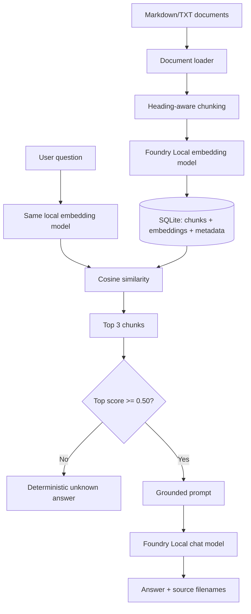

# Local RAG Study Assistant with Microsoft Foundry Local

Tamamen cihaz üzerinde çalışan bu uygulama, yerel yazılım mühendisliği notlarında semantic arama yapar ve yalnızca bulunan belge parçalarına dayanarak cevap üretir. Normal soru-cevap çalışması OpenAI cloud, Azure OpenAI veya başka bir uzak LLM servisi gerektirmez.

## Problem ve amaç

Genel amaçlı dil modelleri ders notlarının güncel veya özel içeriğini bilmeyebilir ve bilgileri uydurabilir. Bu proje, kullanıcı sorusuna önce yerel belgelerden kanıt bulur; ardından bu kanıtı bilgisayarda çalışan Foundry Local modeline vererek kısa, grounded bir cevap ve source dosya adları döndürür. Belgelerde yeterli kanıt yoksa deterministik olarak bilgi bulunmadığını söyler.

## RAG nedir?

Retrieval-Augmented Generation (RAG), cevap üretmeden önce ilgili bilgiyi bir knowledge base'den getiren akıştır. Bu projede retrieval gerçek embedding vektörleri ve cosine similarity ile yapılır; keyword arama veya sabit cevap kullanılmaz.



## Foundry Local'ın rolü

- Chat: `qwen3.5-2b-text`
- Embedding: `qwen3-embedding-0.6b`
- SDK: `foundry-local-sdk==1.2.4`
- Test edilen platform: Apple M1 arm64, 8 GB RAM, macOS, Python 3.12

Alias kullanımı Foundry Local'ın cihaz için uygun varyantı seçmesine izin verir. Bu cihazda katalog WebGPU varyantlarını seçti. Modeller ilk kullanımda indirilir, sonra yerel cache'den yüklenir ve uygulama kapanırken unload edilir.

Microsoft'un güncel kaynakları:

- [Foundry Local başlangıç dokümanı](https://learn.microsoft.com/en-us/windows/ai/foundry-local/get-started)
- [Resmî Foundry Local deposu ve Python SDK örnekleri](https://github.com/microsoft/Foundry-Local)
- [Resmî local RAG tutorial](https://learn.microsoft.com/en-us/azure/foundry-local/tutorials/tutorial-build-rag-app)

> `foundry-local` adlı, `-sdk` içermeyen PyPI paketi Microsoft SDK'sı değildir ve bu projede kullanılmaz.

## Knowledge base

`knowledge/` altında yedi özgün Markdown dokümanı bulunur:

- relational databases
- Git basics
- computer networking
- object-oriented programming
- operating systems
- software testing
- web development

Loader `.md` ve `.txt` dosyalarını UTF-8 olarak okur, boş dosyaları güvenle ele alır ve source filename bilgisini korur. PDF zorunlu minimum kapsamında değildir.

## Ingestion, embeddings ve SQLite

`scripts/ingest.py` şu rebuild akışını çalıştırır:

1. Yerel belgeleri yükler.
2. Heading/paragraf sınırlarını koruyarak chunk'lara böler.
3. 21 chunk'ı local `qwen3-embedding-0.6b` modeliyle batch embed eder.
4. Source, chunk index, content ve 1024 boyutlu embedding'i `data/knowledge.db` içine yazar.
5. Model alias, dimension ve row count metadata'sını doğrular.

Rebuild transaction önceki index'i atomik olarak değiştirir; tekrar çalıştırma duplicate üretmez. Runtime database Git'e eklenmez, her zaman ingestion komutuyla yeniden oluşturulabilir.

## Retrieval ve grounded answer akışı

Kullanıcı sorusu belge ingestion'ında kullanılan aynı embedding modeliyle vektöre çevrilir. SQLite'taki bütün vektörlerle cosine similarity hesaplanır ve varsayılan top 3 chunk score sırasıyla seçilir.

Gerçek testlerde answerable top-1 skorları 0.650893–0.783113, unanswerable skorları 0.197778–0.298080 aralığında kaldı. Bu dağılıma göre 0.50 threshold seçildi. Eşik altındaki sorgu LLM'e gönderilmez. Eşik üstünde source etiketli context ve soru strict system prompt ile local chat modeline verilir.

## Kurulum

Önkoşullar:

- Apple silicon macOS (bu repo için doğrulanan platform) veya Foundry Local'ın desteklediği bir sistem
- yaklaşık 8 GB RAM veya daha fazlası
- ilk dependency/model indirmeleri için internet
- Python 3.11+ (3.12 önerilir)

macOS kurulumu:

```bash
brew install python@3.12 microsoft/foundrylocal/foundrylocal
foundry --version
foundry model info qwen3.5-2b-text
foundry model info qwen3-embedding-0.6b
/opt/homebrew/bin/python3.12 -m venv .venv
source .venv/bin/activate
python -m pip install -r requirements.txt
```

Foundry CLI katalog ve diagnostic kontrolü için yararlıdır. Uygulama entegrasyonu resmî Python SDK'sını kullanır.

## Belgeleri ingest etme

Sanal ortam aktifken:

```bash
python scripts/ingest.py
```

Beklenen özet:

```text
Documents loaded: 7
Chunks generated: 21
Chunks embedded: 21
Embedding dimension: 1024
Rows stored in SQLite: 21
Ingestion completed successfully.
```

## Uygulamayı çalıştırma

```bash
python app.py
```

Ardışık sorular sorulabilir. `exit`, `quit` veya `q` temiz çıkış yapar. Boş giriş güvenli biçimde reddedilir.

Örnek sorular:

```text
What is database normalization and why is it used?
How are TCP and UDP different?
What does polymorphism allow a program to do?
What is virtual memory?
What do integration tests verify?
Who won the 2026 FIFA World Cup?
```

Son soru kasıtlı olarak knowledge base dışındadır ve şu cevabı vermelidir:

```text
The information is not available in the provided documents.
```

## Test ve evaluation

Hızlı unit suite (gerçek model testleri default olarak skip edilir):

```bash
python -m unittest discover -s tests -v
```

Gerçek Foundry Local integration testleri:

```bash
RUN_REAL_FOUNDRY_TESTS=1 python -m unittest discover -s tests -p 'test_real_foundry.py' -v
```

12 vakalık gerçek evaluation:

```bash
python scripts/evaluate.py
```

Tekil smoke kontrolleri:

```bash
python scripts/smoke_chat.py
python scripts/smoke_embeddings.py
python scripts/smoke_retrieval.py
python scripts/smoke_rag.py
python scripts/smoke_unknown.py
```

Son doğrulanan sonuçlar `EVALUATION_REPORT.md` içindedir: 24 unit PASS, 2 gerçek integration PASS ve 12/12 evaluation PASS. Cold model load 14.844 sn; warm query median 2.213 sn olarak ölçüldü.

## Local/offline davranış

İlk SDK, execution-provider ve model indirmeleri internet gerektirebilir. Bunlar cache'lendikten sonra normal ingestion ve soru-cevap akışında:

- API key gerekmez;
- `OPENAI_API_KEY` veya `AZURE_OPENAI_API_KEY` okunmaz;
- OpenAI/Azure endpoint yapılandırılmaz;
- chat ve embedding istekleri Foundry Local SDK üzerinden native local Core'a gider;
- belgeler ve SQLite cihazda kalır.

SDK'nın transitive dependency olarak Python `openai` paketini kurması cloud kullanımı anlamına gelmez. Proje bu paketi doğrudan import etmez; Microsoft SDK onu yalnızca OpenAI-uyumlu request/response tipleri için kullanır ve inference'ı `CoreInterop` ile yerel native runtime'a gönderir.

## Proje yapısı

```text
app.py                    terminal UI
config.py                 model, path, top-k ve threshold ayarları
rag/                      loader, chunker, Foundry modelleri, SQLite, retrieval, pipeline
scripts/ingest.py         reproducible knowledge-index rebuild
scripts/evaluate.py       gerçek evaluation ve timing
knowledge/                yedi local Markdown dokümanı
tests/                    unit, opt-in integration ve evaluation vakaları
data/                     runtime SQLite (Git dışında)
```

## Sınırlamalar

- Yalnızca Markdown ve TXT desteklenir.
- Brute-force cosine search küçük knowledge base için tasarlanmıştır.
- Threshold domain veya belge koleksiyonu ciddi biçimde değişirse yeniden kalibre edilmelidir.
- Model çıktısı generatif olduğu için küçük ifade farklılıkları olabilir.
- Cold model yükleme 8 GB cihazda warm sorgulardan daha uzundur.
- CLI zorunlu minimum UI'dır; web UI çekirdek teslim için eklenmemiştir.

## Gelecekteki geliştirmeler

- PDF ve DOCX loader
- Büyük koleksiyonlar için local vector index
- Chunk/threshold calibration yardımcı aracı
- Cevap içinde chunk seviyesinde tıklanabilir citation
- Çekirdek pipeline'ı değiştirmeyen opsiyonel local web UI

## Diğer teslim dosyaları

- `PROJECT_REPORT.md` — sunuma uygun proje özeti ve lessons learned
- `EVALUATION_REPORT.md` — gerçek test matrisi ve timing
- `DEMO_GUIDE.md` — canlı demo akışı
- `REQUIREMENTS_TRACEABILITY.md` — requirement → code/test kanıtı
- `FINAL_AUDIT.md` — Definition of Done final checklist
