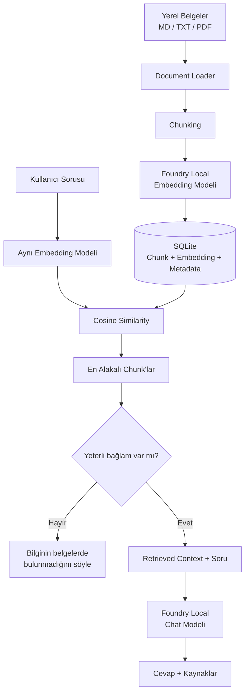

# Microsoft Foundry Local ile Yerel RAG Asistanı

> Microsoft AI Innovators Summer Internship 2026 kapsamında geliştirilen, tamamen cihaz üzerinde çalışan bir Retrieval-Augmented Generation (RAG) uygulaması.

Bu proje; kullanıcıların yerel belgelerini indeksleyip bu belgeler hakkında soru sormasını sağlar. Dokümanlar cihaz üzerinde parçalanır, yerel embedding modeliyle vektörleştirilir, SQLite içinde saklanır ve kullanıcı sorularına en alakalı içerikler semantic retrieval ile bulunur. Yanıtlar Microsoft Foundry Local üzerinde çalışan yerel dil modeli tarafından yalnızca bulunan bağlama dayanarak üretilir.

Normal soru-cevap akışında OpenAI Cloud, Azure OpenAI veya başka bir uzak LLM/embedding servisine ihtiyaç duyulmaz.

---

## Özellikler

- Microsoft Foundry Local ile **tamamen yerel LLM inference**
- Yerel embedding modeli ile **semantic search**
- Markdown, TXT ve metin katmanı bulunan PDF desteği
- Başlık/paragraf farkındalıklı document chunking
- SQLite tabanlı yerel knowledge base
- Cosine similarity ile en alakalı belge parçalarını bulma
- Kaynağa dayalı cevap üretimi
- Kaynak dosya ve parça bilgisini gösterme
- Belgelerde yeterli bilgi yoksa kontrollü fallback
- React + TypeScript + Tailwind CSS web arayüzü
- Drag & drop PDF yükleme
- Belge görüntüleme ve silme
- Terminal üzerinden kullanılabilen CLI
- Unit, integration, E2E ve gerçek Foundry Local testleri
- API key gerektirmeyen yerel çalışma

---

## Nasıl Çalışır?



RAG akışı üç temel adımdan oluşur:

1. **Retrieve:** Kullanıcı sorusuyla en alakalı belge parçaları bulunur.
2. **Augment:** Bulunan parçalar soruyla birlikte modele bağlam olarak verilir.
3. **Generate:** Yerel model yalnızca bu bağlamı kullanarak cevap üretir.

Bu yaklaşım, modelin kendi genel bilgisinden tahmin yürütmesini azaltır ve cevapların kullanıcının gerçek dokümanlarına dayanmasını sağlar.

---

## Kullanılan Teknolojiler

### AI / RAG

- **Microsoft Foundry Local**
- Chat modeli: `qwen3.5-2b-text`
- Embedding modeli: `qwen3-embedding-0.6b`
- `foundry-local-sdk`
- Cosine similarity tabanlı semantic retrieval

### Backend

- Python 3.11+
- FastAPI
- SQLite
- `pypdf`

### Frontend

- React
- TypeScript
- Tailwind CSS
- Vite
- Playwright

---

## Proje Mimarisi

```text
Kullanıcı
   │
   ▼
React Web UI / CLI
   │
   ▼
FastAPI / RAG Pipeline
   │
   ├── Document Loader
   ├── Chunker
   ├── Local Embedding
   ├── Semantic Retrieval
   └── Local LLM
          │
          ▼
       SQLite
```

Uygulamanın web ve terminal arayüzleri aynı çekirdek `RAGPipeline` yapısını kullanır. RAG mantığı frontend içine kopyalanmaz.

---

## Knowledge Base

Yerel belgeler `knowledge/` klasöründe tutulur.

Desteklenen dosya türleri:

- `.md`
- `.txt`
- `.pdf`

PDF dosyalarında gerçek bir metin katmanı bulunmalıdır. Yalnızca görüntü içeren taranmış PDF'ler OCR gerektirdiği için mevcut sürümde desteklenmez.

Belge yükleme sırasında:

```text
Belge
  ↓
Metin çıkarma
  ↓
Chunking
  ↓
Local embedding
  ↓
SQLite
  ↓
Semantic retrieval
```

akışı uygulanır.

Kaynak dosya adı tüm pipeline boyunca korunur ve cevapla birlikte kullanıcıya gösterilebilir.

---

# Kurulum

## Gereksinimler

- Python 3.11 veya üzeri
- Node.js ve npm
- Microsoft Foundry Local
- Yaklaşık 8 GB RAM veya üzeri önerilir
- İlk dependency ve model indirmeleri için internet bağlantısı

Proje Apple Silicon macOS üzerinde doğrulanmıştır. Foundry Local'ın desteklediği diğer sistemlerde de resmi Microsoft kurulum yönergeleri izlenebilir.

---

## 1. Foundry Local ve Python kurulumu

macOS:

```bash
brew install python@3.12 microsoft/foundrylocal/foundrylocal
```

Kurulumu doğrula:

```bash
foundry --version
foundry model info qwen3.5-2b-text
foundry model info qwen3-embedding-0.6b
```

---

## 2. Python sanal ortamını oluştur

Repo kökünde:

```bash
/opt/homebrew/bin/python3.12 -m venv .venv
source .venv/bin/activate
python -m pip install -r requirements.txt
```

Python 3.12 farklı bir konumdaysa sisteminizdeki uygun `python3.12` executable'ını kullanabilirsiniz.

---

## 3. Frontend bağımlılıklarını yükle

```bash
cd frontend
npm install
npm run build
cd ..
```

---

## 4. Knowledge Base'i indeksle

```bash
source .venv/bin/activate
python scripts/ingest.py
```

Bu işlem:

1. `knowledge/` altındaki belgeleri yükler.
2. Metni chunk'lara böler.
3. Her chunk için yerel embedding oluşturur.
4. Chunk, kaynak ve embedding verilerini SQLite'a kaydeder.
5. Knowledge index metadata'sını doğrular.

Re-ingestion işlemi kontrolsüz duplicate üretmez; indeks güvenli biçimde yeniden oluşturulur.

---

# Uygulamayı Çalıştırma

## Production Web Arayüzü

Repo kökünde:

```bash
npm start
```

Ardından:

```text
http://127.0.0.1:8765
```

adresini açın.

Web arayüzünde:

- knowledge base içindeki belgeler görüntülenebilir,
- kullanıcı soru sorabilir,
- cevapların kaynakları görülebilir,
- yeni PDF yüklenebilir,
- belge içeriği görüntülenebilir,
- belgeler güvenli biçimde silinebilir.

---

## Development Modu

Backend ve Vite geliştirme sunucusunu birlikte çalıştırmak için:

```bash
npm run dev
```

Varsayılan geliştirme adresleri:

```text
Backend:  http://127.0.0.1:8765
Frontend: http://127.0.0.1:5173
```

`Control + C` ile her iki süreç de kapatılabilir.

---

## Terminal Arayüzü

CLI sürümünü çalıştırmak için:

```bash
source .venv/bin/activate
python app.py
```

Ardışık sorular sorulabilir.

Çıkış komutları:

```text
çıkış
çık
exit
quit
q
```

---

# PDF Yükleme

Web arayüzündeki **Doküman Ekle** alanı hem drag & drop hem de klasik dosya seçimini destekler.

PDF yükleme akışı gerçek ingestion pipeline'ını kullanır:

1. Dosya adı, içerik türü, PDF başlığı ve boyutu doğrulanır.
2. PDF güvenli biçimde `knowledge/` içine eklenir.
3. `pypdf` ile metin çıkarılır.
4. Metin chunk'lara ayrılır.
5. Chunk'lar Foundry Local embedding modeliyle vektörleştirilir.
6. SQLite indeksi transaction içinde güncellenir.
7. Yeni PDF sonraki sorularda gerçek retrieval kaynağı olarak kullanılabilir.

İşlem başarısız olursa önceki indeks korunur ve yarım kalmış veri aktif knowledge base'e dahil edilmez.

---

# Belge Görüntüleme ve Silme

Sol panelden bir belge seçildiğinde uygulama:

- dosya adını,
- dosya türünü,
- parça sayısını,
- karakter sayısını,
- çıkarılmış metni

gösterebilir.

Belge silme işlemi kullanıcı onayı gerektirir. Silme sonrasında knowledge base yeniden indekslenir ve kaldırılan belge sonraki retrieval sonuçlarında kullanılamaz.

---

# Web API

| Endpoint | Açıklama |
|---|---|
| `GET /api/health` | Yerel indeks ve model durumunu döndürür |
| `GET /api/documents` | Knowledge base içindeki belgeleri listeler |
| `GET /api/documents/{filename}` | Belge içeriği ve metadata döndürür |
| `DELETE /api/documents/{filename}` | Belgeyi siler ve indeksi günceller |
| `POST /api/chat` | RAG pipeline üzerinden cevap üretir |
| `POST /api/documents` | PDF upload / ingestion işlemini başlatır |
| `GET /api/documents/jobs/{id}` | Ingestion job durumunu döndürür |

---

# Örnek Kullanım

Cevabı knowledge base içinde bulunan sorular:

```text
Primary key ile foreign key arasındaki fark nedir?

Polimorfizm nedir?

TCP ile UDP arasındaki temel farklar nelerdir?

Unit test ile integration test arasındaki fark nedir?
```

Knowledge base dışında bir soru:

```text
2026 FIFA Dünya Kupası'nı kim kazandı?
```

Beklenen davranış:

```text
Bu bilgi sağlanan belgelerde bulunmuyor.
```

Bu fallback davranışı, modelin dokümanlarda olmayan bir bilgiyi kendi genel bilgisinden uydurmasını engellemek için tasarlanmıştır.

---

# Testler

## Unit Testler

```bash
source .venv/bin/activate
python -m unittest discover -s tests -v
```

---

## Gerçek Foundry Local Integration Testleri

```bash
RUN_REAL_FOUNDRY_TESTS=1 python -m unittest discover -s tests -p 'test_real_foundry.py' -v
```

---

## Evaluation

```bash
python scripts/evaluate.py
```

Evaluation seti:

- cevaplanabilir sorular,
- cevaplanamaz sorular,
- boş / kısa / genel girdiler,
- farklı dokümanlara ait sorgular

içerir.

Güncel doğrulama sonuçları ve performans ölçümleri için:

[`EVALUATION_REPORT.md`](EVALUATION_REPORT.md)

dosyasına bakın.

Knowledge base önemli ölçüde değiştirildiğinde ingestion ve evaluation yeniden çalıştırılmalıdır.

---

## Tekil Smoke Testleri

```bash
python scripts/smoke_chat.py
python scripts/smoke_embeddings.py
python scripts/smoke_retrieval.py
python scripts/smoke_rag.py
python scripts/smoke_unknown.py
```

PDF uçtan uca kontrolü:

```bash
python scripts/smoke_pdf_upload.py /path/to/test.pdf
```

---

## Frontend Testleri

```bash
cd frontend
npm test
npm run build
npm run test:e2e
```

---

# Local / Offline Davranış

İlk kurulum sırasında aşağıdakiler internet gerektirebilir:

- Python dependency indirmeleri
- Foundry Local kurulumu
- execution provider indirmeleri
- model indirmeleri

Gerekli bileşenler cihazda cache'lendikten sonra normal ingestion ve soru-cevap akışında:

- OpenAI API key gerekmez,
- Azure OpenAI API key gerekmez,
- uzak LLM endpoint'i kullanılmaz,
- chat inference cihaz üzerinde çalışır,
- embedding inference cihaz üzerinde çalışır,
- belgeler cihazda kalır,
- SQLite veritabanı cihazda kalır.

Proje `OPENAI_API_KEY` veya `AZURE_OPENAI_API_KEY` gerektirmez.

---

# Proje Yapısı

```text
.
├── app.py
├── web_app.py
├── config.py
│
├── rag/
│   ├── document_loader.py
│   ├── chunker.py
│   ├── embeddings.py
│   ├── database.py
│   ├── retrieval.py
│   ├── llm.py
│   └── pipeline.py
│
├── web_api/
│   └── ...
│
├── scripts/
│   ├── ingest.py
│   ├── evaluate.py
│   ├── smoke_chat.py
│   ├── smoke_embeddings.py
│   ├── smoke_retrieval.py
│   ├── smoke_rag.py
│   ├── smoke_unknown.py
│   └── smoke_pdf_upload.py
│
├── frontend/
│   └── React + TypeScript + Tailwind UI
│
├── knowledge/
│   └── Yerel MD / TXT / PDF belgeleri
│
├── tests/
│   └── Unit / integration / evaluation testleri
│
├── data/
│   └── Runtime SQLite veritabanı
│
├── README.md
├── PROJECT_REPORT.md
├── EVALUATION_REPORT.md
├── DEMO_GUIDE.md
├── REQUIREMENTS_TRACEABILITY.md
└── FINAL_AUDIT.md
```

---

# Tasarım Kararları

### Neden SQLite?

- Ayrı bir veritabanı sunucusu gerektirmez.
- Tamamen yereldir.
- Küçük knowledge base'ler için yeterlidir.
- Tek dosyalı yapı sayesinde taşınması kolaydır.

### Neden brute-force cosine similarity?

Proje küçük ve yerel document collection'ları hedeflediği için bütün embeddingleri bellekte karşılaştırmak yeterlidir. Büyük veri setlerinde özel bir vector database veya local vector index daha uygun olacaktır.

### Neden relevance threshold?

Yalnızca en yakın sonucu modele vermek, alakasız bir belge parçasının yanlış cevap üretmesine neden olabilir. Retrieval skoru yeterli değilse sistem doğrudan kontrollü fallback döndürür.

Threshold değeri sabit bir varsayım olarak kabul edilmemeli; knowledge base değiştiğinde evaluation sonuçlarına göre yeniden doğrulanmalıdır.

---

# Sınırlamalar

- Taranmış ve yalnızca görüntü içeren PDF'lerde OCR bulunmaz.
- Semantic search mevcut sürümde küçük knowledge base'ler için optimize edilmiştir.
- Büyük koleksiyonlarda özel local vector index daha verimli olacaktır.
- Model çıktısı generatif olduğu için ifade biçiminde küçük farklılıklar oluşabilir.
- İlk model yükleme süresi warm sorgulardan daha uzundur.
- Upload job geçmişi sunucu yeniden başlatıldığında korunmaz; tamamlanmış belgeler ve SQLite indeksi kalıcıdır.

---

# Gelecekteki Geliştirmeler

- Tamamen yerel OCR desteği
- DOCX document loader
- Büyük koleksiyonlar için local vector index
- Incremental ingestion
- Chunk ve threshold kalibrasyon araçları
- Cevap içinde tıklanabilir chunk-level citation
- Kalıcı background ingestion job queue

---

# Proje Dokümantasyonu

Repo içinde ek doğrulama ve sunum dokümanları bulunur:

- [`PROJECT_REPORT.md`](PROJECT_REPORT.md) — proje özeti, mimari kararlar ve lessons learned
- [`EVALUATION_REPORT.md`](EVALUATION_REPORT.md) — test matrisi ve performans sonuçları
- [`DEMO_GUIDE.md`](DEMO_GUIDE.md) — final demo / sunum akışı
- [`REQUIREMENTS_TRACEABILITY.md`](REQUIREMENTS_TRACEABILITY.md) — gereksinim → kod → test kanıtı
- [`FINAL_AUDIT.md`](FINAL_AUDIT.md) — final Definition of Done kontrolü

---

# Microsoft Kaynakları

- [Microsoft Foundry Local](https://github.com/microsoft/Foundry-Local)
- [Foundry Local — Get Started](https://learn.microsoft.com/en-us/windows/ai/foundry-local/get-started)
- [Build a local RAG application](https://learn.microsoft.com/en-us/azure/foundry-local/tutorials/tutorial-build-rag-app)

---

## Kısa Özet

Bu proje, kullanıcının kendi belgelerini cihaz üzerinde indeksleyip bu belgeler hakkında kaynak gösterimli sorular sorabilmesini sağlayan yerel bir RAG sistemidir.

**Belgeler cihazda kalır. Embedding yereldir. LLM yereldir. Cevaplar kaynaklara dayanır.**